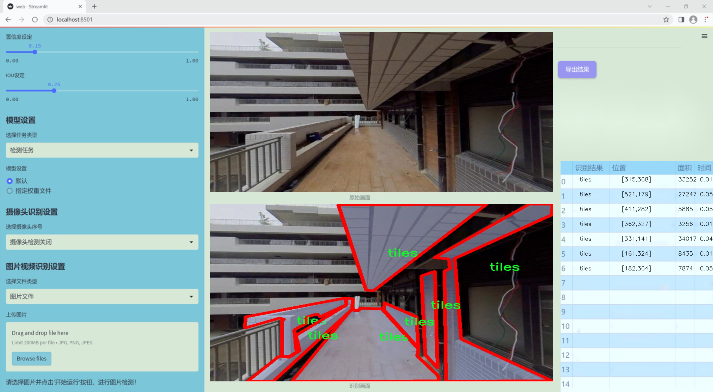
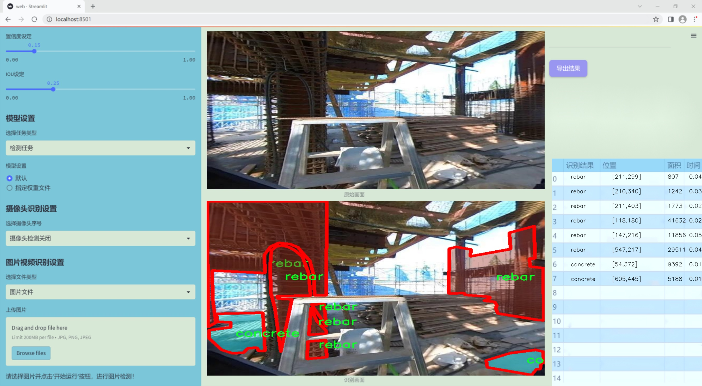
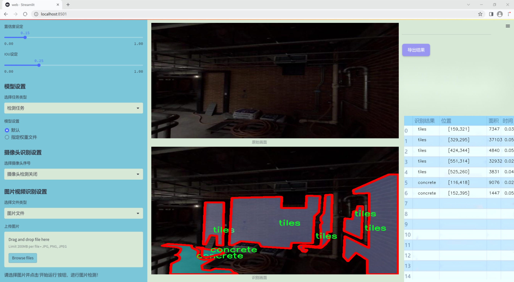
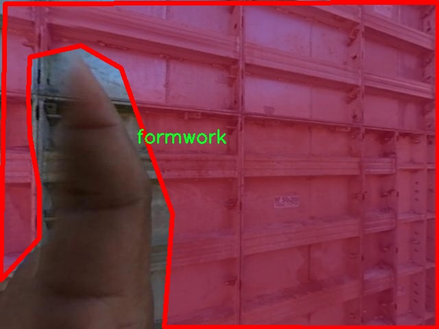
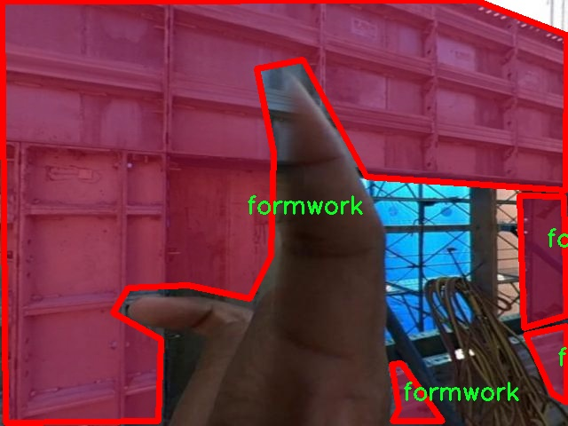
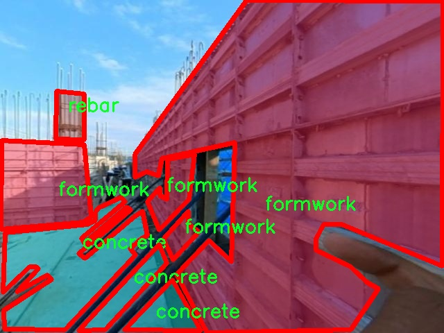
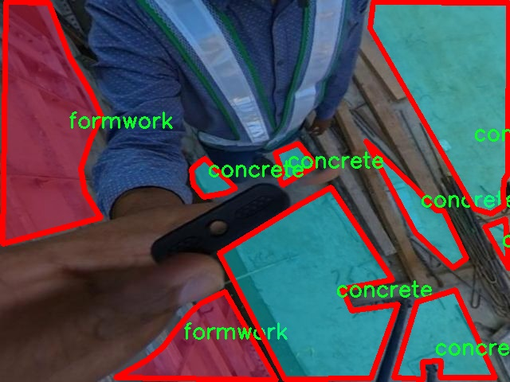
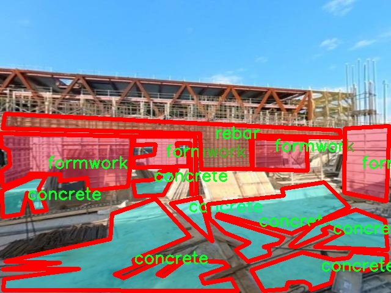

### 1.背景意义

研究背景与意义

随着城市化进程的加快，建筑行业面临着越来越大的压力，尤其是在工期管理和资源调配方面。传统的建筑进度监测方法多依赖人工巡查和现场记录，这不仅耗时耗力，还容易受到人为因素的影响，导致监测结果的准确性和及时性下降。因此，构建一个高效、智能的建筑进度监测系统显得尤为重要。近年来，计算机视觉技术的快速发展为建筑进度监测提供了新的解决方案，尤其是基于深度学习的目标检测和实例分割技术，能够在复杂的工地环境中自动识别和分类不同的建筑材料和构件。

本研究旨在基于改进的YOLOv11模型，开发一套高效的工地建筑进度监测系统。该系统将利用包含1200张图像的数据集，这些图像涵盖了四类主要建筑材料：混凝土、模板、钢筋和瓷砖。通过对这些材料的实时监测，系统能够有效评估施工进度，识别潜在的延误因素，并为项目管理提供数据支持。YOLOv11作为一种先进的目标检测模型，具备高效的实时处理能力和优越的检测精度，能够在复杂的工地环境中实现对建筑材料的准确识别和分类。

此外，建筑进度监测不仅关乎施工效率，还直接影响到项目的成本控制和资源配置。通过引入智能化的监测系统，能够实现对施工现场的动态管理，提升项目的透明度和可控性，从而为建筑行业的数字化转型提供有力支持。综上所述，本研究不仅具有重要的理论意义，还具备广泛的应用前景，将为建筑行业的智能化发展贡献新的思路和方法。

### 2.视频效果

[2.1 视频效果](https://www.bilibili.com/video/BV1nvqrYDEsc/)

### 3.图片效果







##### [项目涉及的源码数据来源链接](https://kdocs.cn/l/cszuIiCKVNis)**

注意：本项目提供训练的数据集和训练教程,由于版本持续更新,暂不提供权重文件（best.pt）,请按照6.训练教程进行训练后实现上图演示的效果。

### 4.数据集信息

##### 4.1 本项目数据集类别数＆类别名

nc: 4
names: ['concrete', 'formwork', 'rebar', 'tiles']


该项目为【图像分割】数据集，请在【训练教程和Web端加载模型教程（第三步）】这一步的时候按照【图像分割】部分的教程来训练

##### 4.2 本项目数据集信息介绍

本项目数据集信息介绍

本项目旨在改进YOLOv11模型，以实现高效的工地建筑进度监测系统。为此，我们构建了一个专门针对“Construction Progress Monitoring”主题的数据集，该数据集包含四个主要类别，分别为混凝土（concrete）、模板（formwork）、钢筋（rebar）和瓷砖（tiles）。这些类别涵盖了建筑施工过程中关键的材料和构件，能够有效反映出施工进度的不同阶段。

在数据集的构建过程中，我们收集了大量来自实际工地的图像数据，确保样本的多样性和代表性。这些图像不仅包括不同施工阶段的场景，还涵盖了不同天气条件、光照变化和视角的情况，以增强模型的鲁棒性。每个类别的图像均经过精心标注，确保在训练过程中能够准确识别和分类。这种精确的标注对于提升YOLOv11的检测性能至关重要，因为它直接影响到模型的学习效果和最终的监测精度。

此外，数据集还考虑到了实际应用中的挑战，例如施工现场的复杂性和动态变化。通过引入多样化的场景和材料，我们希望模型能够适应不同的施工环境，从而在实际监测中提供可靠的支持。随着建筑行业对智能化监测系统需求的不断增加，本项目的数据集不仅为YOLOv11的训练提供了坚实的基础，也为未来在建筑进度监测领域的研究和应用开辟了新的方向。通过对该数据集的深入分析和应用，我们期望能够推动建筑施工管理的智能化进程，提高施工效率和安全性。











### 5.全套项目环境部署视频教程（零基础手把手教学）

[5.1 所需软件PyCharm和Anaconda安装教程（第一步）](https://www.bilibili.com/video/BV1BoC1YCEKi/?spm_id_from=333.999.0.0&vd_source=bc9aec86d164b67a7004b996143742dc)


[5.2 安装Python虚拟环境创建和依赖库安装视频教程（第二步）](https://www.bilibili.com/video/BV1ZoC1YCEBw?spm_id_from=333.788.videopod.sections&vd_source=bc9aec86d164b67a7004b996143742dc)

### 6.改进YOLOv11训练教程和Web_UI前端加载模型教程（零基础手把手教学）

[6.1 改进YOLOv11训练教程和Web_UI前端加载模型教程（第三步）](https://www.bilibili.com/video/BV1BoC1YCEhR?spm_id_from=333.788.videopod.sections&vd_source=bc9aec86d164b67a7004b996143742dc)


按照上面的训练视频教程链接加载项目提供的数据集，运行train.py即可开始训练



     Epoch   gpu_mem       box       obj       cls    labels  img_size
     1/200     20.8G   0.01576   0.01955  0.007536        22      1280: 100%|██████████| 849/849 [14:42<00:00,  1.04s/it]
               Class     Images     Labels          P          R     mAP@.5 mAP@.5:.95: 100%|██████████| 213/213 [01:14<00:00,  2.87it/s]
                 all       3395      17314      0.994      0.957      0.0957      0.0843

     Epoch   gpu_mem       box       obj       cls    labels  img_size
     2/200     20.8G   0.01578   0.01923  0.007006        22      1280: 100%|██████████| 849/849 [14:44<00:00,  1.04s/it]
               Class     Images     Labels          P          R     mAP@.5 mAP@.5:.95: 100%|██████████| 213/213 [01:12<00:00,  2.95it/s]
                 all       3395      17314      0.996      0.956      0.0957      0.0845

     Epoch   gpu_mem       box       obj       cls    labels  img_size
     3/200     20.8G   0.01561    0.0191  0.006895        27      1280: 100%|██████████| 849/849 [10:56<00:00,  1.29it/s]
               Class     Images     Labels          P          R     mAP@.5 mAP@.5:.95: 100%|███████   | 187/213 [00:52<00:00,  4.04it/s]
                 all       3395      17314      0.996      0.957      0.0957      0.0845


###### [项目数据集下载链接](https://kdocs.cn/l/cszuIiCKVNis)

### 7.原始YOLOv11算法讲解


YOLO11 是 Ultralytics YOLO 系列的最新版本，结合了尖端的准确性、速度和效率，用于目标检测、分割、分类、定向边界框和姿态估计。与
YOLOv8 相比，它具有更少的参数和更好的结果，不难预见，YOLO11 在边缘设备上更高效、更快，将频繁出现在计算机视觉领域的最先进技术（SOTA）中。


**主要特点**

  * **增强的特征提取：**YOLO11 使用改进的主干和颈部架构来增强特征提取，以实现更精确的目标检测和复杂任务的性能。

  * **针对效率和速度优化：**精细的架构设计和优化的训练流程在保持准确性和性能之间最佳平衡的同时，提供更快的处理速度。

  * **更少的参数，更高的准确度：**YOLO11m 在 COCO 数据集上实现了比 YOLOv8m 更高的 mAP，参数减少了 22%，提高了计算效率，同时不牺牲准确度。

  * **跨环境的适应性：**YOLO11 可以无缝部署在边缘设备、云平台和配备 NVIDIA GPU 的系统上，确保最大的灵活性。

  * **支持广泛的任务范围：**YOLO11 支持各种计算机视觉任务，如目标检测、实例分割、图像分类、姿态估计和定向目标检测（OBB）。


### 8.200+种全套改进YOLOV11创新点原理讲解

#### 8.1 200+种全套改进YOLOV11创新点原理讲解大全

由于篇幅限制，每个创新点的具体原理讲解就不全部展开，具体见下列网址中的改进模块对应项目的技术原理博客网址【Blog】（创新点均为模块化搭建，原理适配YOLOv5~YOLOv11等各种版本）

[改进模块技术原理博客【Blog】网址链接](https://gitee.com/qunmasj/good)


#### 8.2 精选部分改进YOLOV11创新点原理讲解

###### 这里节选部分改进创新点展开原理讲解(完整的改进原理见上图和[改进模块技术原理博客链接](https://gitee.com/qunmasj/good)【如果此小节的图加载失败可以通过CSDN或者Github搜索该博客的标题访问原始博客，原始博客图片显示正常】
### 全维动态卷积ODConv
鉴于上述讨论，我们的ODConv引入了一种多维注意机制，该机制具有并行策略，用于学习卷积核在核空间的所有四个维度上的不同注意。图提供了CondConv、DyConv和ODConv的示意性比较。

ODConv的公式：根据等式1中的符号，ODConv可定义为


 将注意力标量分配给整个卷积核。图2示出了将这四种类型的关注乘以n个卷积核的过程。原则上，这四种类型的关注是相互补充的，并且以位置、信道、滤波器和核的顺序将它们逐步乘以卷积核 
 ，使得卷积运算不同w.r.t.所有空间位置、所有输入信道、所有滤波器和输入x的所有核，提供捕获丰富上下文线索的性能保证。因此，ODConv可以显著增强CNN基本卷积运算的特征提取能力。此外，具有单个卷积核的ODConv可以与标准CondConv和DyConv竞争或优于它们，为最终模型引入的额外参数大大减少。提供了大量实验来验证这些优点。通过比较等式1和等式2，我们可以清楚地看到，ODConv是一种更广义的动态卷积。此外，当设置n=1且 所有分量均为1时，只关注滤波器方向 的ODConv将减少为：将基于输入特征的SE变量应用于卷积滤波器，然后进行卷积运算（注意原始SE（Hu等人，2018b）基于输出特征，并且用于重新校准输出特征本身）。这种SE变体是ODConv的特例。


图：将ODConv中的四种注意类型逐步乘以卷积核的示例。（a） 沿空间维度的逐位置乘法运算，（b）沿输入信道维度的逐信道乘法运算、（c）沿输出信道维度的按滤波器乘法运算，以及（d）沿卷积核空间的核维度的按核乘法运算。方法部分对符号进行了说明
实现：对于ODConv，一个关键问题是如何计算卷积核的四种关注度 。继CondConv和DyConv之后，我们还使用SE型注意力模块（Hu等人，2018b），但将多个头部作为来计算它们，其结构如图所示。具体而言，首先通过逐通道全局平均池（GAP）运算将输入压缩到具有长度的特征向量中。随后，存在完全连接（FC）层和四个头部分支。ReLU（Krizhevsky等人，2012）位于FC层之后。FC层将压缩特征向量映射到具有缩减比的低维空间（根据消融实验，我们在所有主要实验中设置 ，避免了高模型复杂度）。对于四个头部分支，每个分支都有一个输出大小如图。

### 引入ODConv的改进YOLO
参考这篇博客涵盖了引入ODConv的改进YOLOv11系统的内容，ODConv采用多维注意机制，在卷积核空间的四个维度上学习不同的注意。结合了CondConv和DyConv的优势，ODConv通过图示的四种注意类型逐步与卷积核相乘，以捕获丰富的上下文线索，提升特征提取能力。

#### ODConv结构与方法
ODConv的公式和图示展示了其关注力分配给卷积核的方式，其中四种类型的关注以位置、信道、滤波器和核的顺序逐步与卷积核相乘。这种结构保证了卷积运算不同于标准的Conv操作，能够捕获更多上下文信息，从而增强了CNN的特征提取能力。另外，单个卷积核的ODConv在性能上能够与CondConv和DyConv相竞争，并且引入的额外参数大幅减少。

ODConv的特殊之处在于其广义的动态卷积性质，同时在特定条件下（n=1且所有分量为1），它可以退化为一种特例，即只关注滤波器方向，这类似于基于输入特征的SE变体，但不同于原始SE，它基于输出特征。

#### ODConv的实现
关键问题在于如何计算卷积核的四种关注度。ODConv采用了SE型注意力模块，结合了多个头部来计算这些关注度。具体实现上，通过逐通道全局平均池运算和完全连接层，将输入压缩为特征向量，随后使用四个头部分支来计算四种不同类型的关注。这样的结构能在保持模型复杂度可控的情况下，提升了特征的表征能力。

ODConv的引入为YOLOv11带来了显著的性能提升，并且通过大量实验证明了其在特征提取方面的优越性。其结合了多维注意机制和卷积操作，为目标检测和分拣系统的提升带来了新的思路和性能突破。


### 9.系统功能展示

图9.1.系统支持检测结果表格显示

  图9.2.系统支持置信度和IOU阈值手动调节

  图9.3.系统支持自定义加载权重文件best.pt(需要你通过步骤5中训练获得)

  图9.4.系统支持摄像头实时识别

  图9.5.系统支持图片识别

  图9.6.系统支持视频识别

  图9.7.系统支持识别结果文件自动保存

  图9.8.系统支持Excel导出检测结果数据


### 10. YOLOv11核心改进源码讲解

#### 10.1 block.py

以下是经过简化和注释的核心代码部分，保留了主要功能并添加了详细的中文注释：

```python
import torch
import torch.nn as nn
import torch.nn.functional as F

def autopad(k, p=None, d=1):
    """自动填充以保持输出形状相同。"""
    if d > 1:
        k = d * (k - 1) + 1 if isinstance(k, int) else [d * (x - 1) + 1 for x in k]  # 实际的卷积核大小
    if p is None:
        p = k // 2 if isinstance(k, int) else [x // 2 for x in k]  # 自动填充
    return p

class Conv(nn.Module):
    """卷积层，包含卷积、批归一化和激活函数。"""
    def __init__(self, in_channels, out_channels, kernel_size=3, stride=1, padding=None, groups=1, act=True):
        super().__init__()
        self.conv = nn.Conv2d(in_channels, out_channels, kernel_size, stride, autopad(kernel_size, padding), groups=groups, bias=False)
        self.bn = nn.BatchNorm2d(out_channels)
        self.act = nn.SiLU() if act else nn.Identity()  # 默认激活函数为SiLU

    def forward(self, x):
        return self.act(self.bn(self.conv(x)))  # 前向传播

class Bottleneck(nn.Module):
    """标准瓶颈块，包含两个卷积层。"""
    def __init__(self, c1, c2, shortcut=True, g=1, k=(3, 3), e=0.5):
        super().__init__()
        c_ = int(c2 * e)  # 隐藏通道数
        self.cv1 = Conv(c1, c_, k[0], 1)  # 第一个卷积
        self.cv2 = Conv(c_, c2, k[1], 1)  # 第二个卷积
        self.add = shortcut and c1 == c2  # 是否使用快捷连接

    def forward(self, x):
        return x + self.cv2(self.cv1(x)) if self.add else self.cv2(self.cv1(x))  # 前向传播

class C3k(nn.Module):
    """C3k模块，包含多个瓶颈块。"""
    def __init__(self, c1, c2, n=1, shortcut=False, g=1, e=0.5, k=3):
        super().__init__()
        self.m = nn.Sequential(*(Bottleneck(c1, c2, shortcut, g, k=(k, k), e=1.0) for _ in range(n)))  # 创建n个瓶颈块

    def forward(self, x):
        return self.m(x)  # 前向传播

class DynamicConv(nn.Module):
    """动态卷积层，使用条件卷积。"""
    def __init__(self, c1, c2, k=1, s=1, p=None, g=1, d=1, act=True, num_experts=4):
        super().__init__()
        self.conv = nn.Sequential(
            DynamicConv_Single(c1, c2, kernel_size=k, stride=s, padding=autopad(k, p, d), dilation=d, groups=g, num_experts=num_experts),
            nn.BatchNorm2d(c2),
            nn.SiLU() if act else nn.Identity()
        )

    def forward(self, x):
        return self.conv(x)  # 前向传播

class SEAttention(nn.Module):
    """通道注意力机制。"""
    def __init__(self, in_channels, reduction=16):
        super(SEAttention, self).__init__()
        self.fc1 = nn.Conv2d(in_channels, in_channels // reduction, kernel_size=1)
        self.fc2 = nn.Conv2d(in_channels // reduction, in_channels, kernel_size=1)

    def forward(self, x):
        b, c, _, _ = x.size()
        y = F.adaptive_avg_pool2d(x, 1).view(b, c)  # 全局平均池化
        y = self.fc2(F.relu(self.fc1(y.view(b, c, 1, 1))))  # 通过全连接层
        return x * torch.sigmoid(y).view(b, c, 1, 1)  # 应用注意力

class DynamicAlignFusion(nn.Module):
    """动态对齐融合模块。"""
    def __init__(self, inc, ouc):
        super().__init__()
        self.conv_align1 = Conv(inc[0], ouc, 1)
        self.conv_align2 = Conv(inc[1], ouc, 1)
        self.conv_concat = Conv(ouc * 2, ouc * 2, 3)

    def forward(self, x):
        x1, x2 = x
        x1, x2 = self.conv_align1(x1), self.conv_align2(x2)
        x_concat = self.conv_concat(torch.cat([x1, x2], dim=1))
        return x_concat  # 返回融合后的特征

# 其他模块的定义...

# 这里省略了其他模块的定义和实现，主要集中在核心部分的注释。
```

上述代码保留了核心模块的实现，注释中解释了每个类和方法的功能。其他不必要的部分可以根据具体需求进一步删减。

这个 `block.py` 文件包含了许多深度学习模型中的模块和类，主要用于构建卷积神经网络（CNN）和自注意力机制。以下是对文件中主要部分的逐步分析和说明。

首先，文件导入了许多必要的库，包括 PyTorch、NumPy、以及一些自定义模块。然后，定义了一些通用的函数和类，例如 `autopad` 用于自动计算卷积的填充，`make_divisible` 用于确保通道数是可被特定数整除的。

接下来，文件中定义了多个神经网络模块，包括不同类型的卷积层、注意力机制、以及一些特定的网络结构。以下是一些重要的类和它们的功能：

1. **卷积层和激活函数**：
   - `Conv`、`DWConv`、`DSConv` 等类用于定义不同类型的卷积操作。
   - `h_swish` 和 `h_sigmoid` 是自定义的激活函数。

2. **注意力机制**：
   - `DyHeadBlock` 和 `DyHeadBlockWithDCNV3` 是动态头部模块，使用了可调节的卷积和注意力机制。
   - `CA_HSFPN` 和 `GLSA` 是通道注意力和空间注意力模块，用于增强特征图的表达能力。

3. **特定的网络结构**：
   - `C3k` 和 `C3k2` 是基于 CSP（Cross Stage Partial）结构的模块，允许通过不同的层次组合特征。
   - `RepViTBlock` 和 `RepViTBlock_EMA` 是用于视觉变换器（Vision Transformer）的模块，结合了卷积和自注意力机制。

4. **上采样和下采样模块**：
   - `Upsample` 和 `Downsample` 用于特征图的尺寸调整。
   - `WaveletPool` 和 `WaveletUnPool` 使用小波变换进行特征提取和重建。

5. **融合模块**：
   - `Fusion` 和 `DynamicInterpolationFusion` 用于将不同尺度的特征图进行融合，增强模型的多尺度特征学习能力。

6. **自定义的复合模块**：
   - `CSPStage` 和 `RepNCSPELAN4` 是复合结构，结合了多种卷积和注意力机制，以提高特征提取的效率和效果。

7. **特定的网络设计**：
   - `GOLDYOLO` 和 `SMAFormer` 是为特定任务（如目标检测）设计的网络结构，集成了多种先进的特征提取和融合技术。

文件中还包含了许多细节，例如各个模块的初始化、前向传播逻辑、以及在训练和推理模式下的不同处理方式。整体来看，这个文件展示了一个复杂的深度学习框架，旨在通过多种技术的结合来提高视觉任务的性能。

#### 10.2 wtconv2d.py

以下是经过简化和注释的核心代码部分，保留了小波变换的实现和卷积层的定义：

```python
import torch
import torch.nn as nn
import torch.nn.functional as F
import pywt

# 创建小波滤波器
def create_wavelet_filter(wave, in_size, out_size, type=torch.float):
    # 使用pywt库创建小波对象
    w = pywt.Wavelet(wave)
    # 反转小波的分解高通和低通滤波器
    dec_hi = torch.tensor(w.dec_hi[::-1], dtype=type)
    dec_lo = torch.tensor(w.dec_lo[::-1], dtype=type)
    
    # 生成分解滤波器
    dec_filters = torch.stack([
        dec_lo.unsqueeze(0) * dec_lo.unsqueeze(1),
        dec_lo.unsqueeze(0) * dec_hi.unsqueeze(1),
        dec_hi.unsqueeze(0) * dec_lo.unsqueeze(1),
        dec_hi.unsqueeze(0) * dec_hi.unsqueeze(1)
    ], dim=0)

    # 扩展滤波器以适应输入通道数
    dec_filters = dec_filters[:, None].repeat(in_size, 1, 1, 1)

    # 反转小波的重构高通和低通滤波器
    rec_hi = torch.tensor(w.rec_hi[::-1], dtype=type).flip(dims=[0])
    rec_lo = torch.tensor(w.rec_lo[::-1], dtype=type).flip(dims=[0])
    
    # 生成重构滤波器
    rec_filters = torch.stack([
        rec_lo.unsqueeze(0) * rec_lo.unsqueeze(1),
        rec_lo.unsqueeze(0) * rec_hi.unsqueeze(1),
        rec_hi.unsqueeze(0) * rec_lo.unsqueeze(1),
        rec_hi.unsqueeze(0) * rec_hi.unsqueeze(1)
    ], dim=0)

    # 扩展滤波器以适应输出通道数
    rec_filters = rec_filters[:, None].repeat(out_size, 1, 1, 1)

    return dec_filters, rec_filters

# 小波变换
def wavelet_transform(x, filters):
    b, c, h, w = x.shape  # 获取输入的形状
    pad = (filters.shape[2] // 2 - 1, filters.shape[3] // 2 - 1)  # 计算填充
    # 进行2D卷积以实现小波变换
    x = F.conv2d(x, filters.to(x.dtype).to(x.device), stride=2, groups=c, padding=pad)
    x = x.reshape(b, c, 4, h // 2, w // 2)  # 重新调整形状
    return x

# 反小波变换
def inverse_wavelet_transform(x, filters):
    b, c, _, h_half, w_half = x.shape  # 获取输入的形状
    pad = (filters.shape[2] // 2 - 1, filters.shape[3] // 2 - 1)  # 计算填充
    x = x.reshape(b, c * 4, h_half, w_half)  # 重新调整形状
    # 进行反卷积以实现反小波变换
    x = F.conv_transpose2d(x, filters.to(x.dtype).to(x.device), stride=2, groups=c, padding=pad)
    return x

# 定义小波卷积层
class WTConv2d(nn.Module):
    def __init__(self, in_channels, out_channels, kernel_size=5, stride=1, bias=True, wt_levels=1, wt_type='db1'):
        super(WTConv2d, self).__init__()

        assert in_channels == out_channels  # 输入通道数和输出通道数必须相等

        self.in_channels = in_channels
        self.wt_levels = wt_levels
        self.stride = stride

        # 创建小波滤波器
        self.wt_filter, self.iwt_filter = create_wavelet_filter(wt_type, in_channels, in_channels, torch.float)
        self.wt_filter = nn.Parameter(self.wt_filter, requires_grad=False)  # 小波滤波器参数
        self.iwt_filter = nn.Parameter(self.iwt_filter, requires_grad=False)  # 反小波滤波器参数

        # 基础卷积层
        self.base_conv = nn.Conv2d(in_channels, in_channels, kernel_size, padding='same', stride=1, groups=in_channels, bias=bias)

    def forward(self, x):
        # 小波变换和反小波变换的前向传播逻辑
        # 省略具体实现，保留结构
        pass

# 定义一个简单的缩放模块
class _ScaleModule(nn.Module):
    def __init__(self, dims, init_scale=1.0):
        super(_ScaleModule, self).__init__()
        self.weight = nn.Parameter(torch.ones(*dims) * init_scale)  # 初始化缩放权重

    def forward(self, x):
        return torch.mul(self.weight, x)  # 进行缩放
```

### 代码说明：
1. **创建小波滤波器**：使用`pywt`库生成小波的分解和重构滤波器。
2. **小波变换和反小波变换**：通过卷积和反卷积实现小波变换和反小波变换。
3. **WTConv2d类**：定义了一个小波卷积层，包含小波变换的初始化和前向传播的框架。
4. **_ScaleModule类**：定义了一个简单的缩放模块，用于调整输出的缩放因子。

这个程序文件 `wtconv2d.py` 实现了一个基于小波变换的二维卷积层，主要用于深度学习中的图像处理任务。程序中使用了 PyTorch 框架，并结合了小波变换的数学原理，提供了对输入图像的多层次特征提取。

首先，程序导入了必要的库，包括 PyTorch 及其神经网络模块、功能模块和小波变换相关的库。接着，定义了一个函数 `create_wavelet_filter`，该函数根据指定的小波类型生成小波变换和逆小波变换所需的滤波器。生成的滤波器会根据输入和输出通道的数量进行扩展，以便在卷积操作中使用。

接下来，定义了两个主要的变换函数：`wavelet_transform` 和 `inverse_wavelet_transform`。前者用于对输入数据进行小波变换，后者则用于逆小波变换。它们都使用了 PyTorch 的卷积操作，并在计算过程中考虑了数据的维度和填充方式。

在小波变换的实现中，使用了 PyTorch 的 `Function` 类来定义自定义的前向和反向传播操作。`WaveletTransform` 和 `InverseWaveletTransform` 类分别实现了小波变换和逆小波变换的前向和反向传播逻辑。这使得在训练过程中，网络能够正确地计算梯度。

`WTConv2d` 类是整个程序的核心，继承自 `nn.Module`。在初始化方法中，设置了输入和输出通道数、小波变换的层数、卷积核大小等参数，并生成相应的小波滤波器。该类还定义了多个卷积层和缩放模块，用于处理小波变换后的特征。

在 `forward` 方法中，首先对输入数据进行小波变换，提取出低频和高频特征。然后，利用小波卷积层对这些特征进行处理，并在最后进行逆小波变换，恢复到原始特征图的维度。最后，经过基础卷积和缩放操作后，返回最终的输出。

此外，程序中还定义了一个 `_ScaleModule` 类，用于对特征图进行缩放，确保网络在训练过程中能够学习到适当的缩放因子。

总的来说，这个程序实现了一个结合小波变换的卷积神经网络层，能够有效地提取图像中的多层次特征，适用于各种图像处理任务。

#### 10.3 starnet.py

以下是代码中最核心的部分，并附上详细的中文注释：

```python
import torch
import torch.nn as nn
from timm.models.layers import DropPath, trunc_normal_

class ConvBN(torch.nn.Sequential):
    """
    定义一个卷积层后接批归一化层的组合模块。
    """
    def __init__(self, in_planes, out_planes, kernel_size=1, stride=1, padding=0, dilation=1, groups=1, with_bn=True):
        super().__init__()
        # 添加卷积层
        self.add_module('conv', torch.nn.Conv2d(in_planes, out_planes, kernel_size, stride, padding, dilation, groups))
        # 如果需要，添加批归一化层
        if with_bn:
            self.add_module('bn', torch.nn.BatchNorm2d(out_planes))
            # 初始化批归一化层的权重和偏置
            torch.nn.init.constant_(self.bn.weight, 1)
            torch.nn.init.constant_(self.bn.bias, 0)

class Block(nn.Module):
    """
    StarNet中的基本模块，包含深度可分离卷积和MLP结构。
    """
    def __init__(self, dim, mlp_ratio=3, drop_path=0.):
        super().__init__()
        # 深度可分离卷积
        self.dwconv = ConvBN(dim, dim, 7, 1, (7 - 1) // 2, groups=dim, with_bn=True)
        # MLP的两个线性变换
        self.f1 = ConvBN(dim, mlp_ratio * dim, 1, with_bn=False)
        self.f2 = ConvBN(dim, mlp_ratio * dim, 1, with_bn=False)
        # 线性变换后接批归一化
        self.g = ConvBN(mlp_ratio * dim, dim, 1, with_bn=True)
        # 第二个深度可分离卷积
        self.dwconv2 = ConvBN(dim, dim, 7, 1, (7 - 1) // 2, groups=dim, with_bn=False)
        self.act = nn.ReLU6()  # 激活函数
        self.drop_path = DropPath(drop_path) if drop_path > 0. else nn.Identity()  # 随机深度

    def forward(self, x):
        input = x  # 保存输入
        x = self.dwconv(x)  # 经过深度可分离卷积
        x1, x2 = self.f1(x), self.f2(x)  # MLP的两个分支
        x = self.act(x1) * x2  # 元素级乘法
        x = self.dwconv2(self.g(x))  # 经过线性变换和第二个卷积
        x = input + self.drop_path(x)  # 残差连接
        return x

class StarNet(nn.Module):
    """
    StarNet网络结构，包含多个阶段和基本模块。
    """
    def __init__(self, base_dim=32, depths=[3, 3, 12, 5], mlp_ratio=4, drop_path_rate=0.0, num_classes=1000, **kwargs):
        super().__init__()
        self.num_classes = num_classes
        self.in_channel = 32
        # stem层
        self.stem = nn.Sequential(ConvBN(3, self.in_channel, kernel_size=3, stride=2, padding=1), nn.ReLU6())
        dpr = [x.item() for x in torch.linspace(0, drop_path_rate, sum(depths))]  # 随机深度
        # 构建各个阶段
        self.stages = nn.ModuleList()
        cur = 0
        for i_layer in range(len(depths)):
            embed_dim = base_dim * 2 ** i_layer  # 当前阶段的嵌入维度
            down_sampler = ConvBN(self.in_channel, embed_dim, 3, 2, 1)  # 下采样层
            self.in_channel = embed_dim
            blocks = [Block(self.in_channel, mlp_ratio, dpr[cur + i]) for i in range(depths[i_layer])]  # 当前阶段的模块
            cur += depths[i_layer]
            self.stages.append(nn.Sequential(down_sampler, *blocks))  # 将下采样层和模块组合

    def forward(self, x):
        features = []  # 特征列表
        x = self.stem(x)  # 经过stem层
        features.append(x)
        for stage in self.stages:
            x = stage(x)  # 经过每个阶段
            features.append(x)
        return features  # 返回所有阶段的特征

# 定义不同规模的StarNet模型
def starnet_s1(pretrained=False, **kwargs):
    model = StarNet(24, [2, 2, 8, 3], **kwargs)
    return model

def starnet_s2(pretrained=False, **kwargs):
    model = StarNet(32, [1, 2, 6, 2], **kwargs)
    return model

def starnet_s3(pretrained=False, **kwargs):
    model = StarNet(32, [2, 2, 8, 4], **kwargs)
    return model

def starnet_s4(pretrained=False, **kwargs):
    model = StarNet(32, [3, 3, 12, 5], **kwargs)
    return model
```

### 代码说明：
1. **ConvBN**: 这是一个组合模块，包含卷积层和可选的批归一化层，方便构建网络。
2. **Block**: 这是StarNet的基本构建块，包含深度可分离卷积和多层感知机（MLP），并通过元素级乘法进行特征融合。
3. **StarNet**: 这是整个网络的主体，包含多个阶段，每个阶段由下采样层和多个Block组成。网络的前向传播会返回每个阶段的特征。
4. **模型构建函数**: `starnet_s1`到`starnet_s4`是不同规模的StarNet模型构建函数，可以根据需要创建不同的网络结构。

这个程序文件实现了一个名为StarNet的神经网络模型，主要用于图像处理任务。StarNet的设计目标是简化网络结构，以突出元素级乘法的关键贡献。代码中没有使用层级缩放和训练过程中的指数移动平均（EMA），这些设计选择可能会进一步提升模型性能。

文件开头部分包含了模块的基本信息，包括作者的名字和联系方式，以及最后修改的日期。接下来，程序导入了必要的库，包括PyTorch和一些特定的模块，如DropPath和trunc_normal_。

程序定义了一个包含多个模型的列表，允许用户选择不同的StarNet变体（如starnet_s050、starnet_s100等）。每个模型都有对应的预训练权重的下载链接，方便用户加载预训练模型。

ConvBN类是一个简单的卷积层与批归一化（Batch Normalization）的组合。构造函数中初始化了卷积层和可选的批归一化层，并对其权重和偏置进行了初始化。

Block类实现了StarNet的基本构建块。它包含了深度可分离卷积、两个全连接层和一个元素级乘法操作。前向传播过程中，输入经过深度卷积、两个全连接层处理后，经过ReLU6激活函数，再进行元素级乘法，最后通过另一个卷积层和残差连接输出。

StarNet类是整个网络的主体。它包含了一个stem层（初始卷积层），以及多个阶段（stages），每个阶段由一个下采样层和多个Block组成。构造函数中还实现了权重初始化的方法。前向传播过程中，输入数据经过stem层和各个阶段，最终返回特征图。

最后，程序定义了多个函数（如starnet_s1、starnet_s2等），用于创建不同配置的StarNet模型，并提供了加载预训练权重的选项。这些函数允许用户根据需求快速构建和使用不同规模的StarNet模型。

整体来看，这个程序文件展示了StarNet模型的结构和实现细节，强调了其在设计上的简洁性和有效性。

#### 10.4 activation.py

```python
import torch
import torch.nn as nn

class AGLU(nn.Module):
    """AGLU激活函数模块，来源于https://github.com/kostas1515/AGLU。"""

    def __init__(self, device=None, dtype=None) -> None:
        """初始化AGLU激活函数模块。"""
        super().__init__()
        # 使用Softplus作为基础激活函数，beta设为-1.0
        self.act = nn.Softplus(beta=-1.0)
        # 初始化lambda参数，使用均匀分布
        self.lambd = nn.Parameter(nn.init.uniform_(torch.empty(1, device=device, dtype=dtype)))  
        # 初始化kappa参数，使用均匀分布
        self.kappa = nn.Parameter(nn.init.uniform_(torch.empty(1, device=device, dtype=dtype)))  

    def forward(self, x: torch.Tensor) -> torch.Tensor:
        """计算AGLU激活函数的前向传播。"""
        # 将lambda参数限制在最小值0.0001，以避免除零错误
        lam = torch.clamp(self.lambd, min=0.0001)
        # 计算AGLU激活函数的输出
        return torch.exp((1 / lam) * self.act((self.kappa * x) - torch.log(lam)))
```

### 代码核心部分说明：
1. **类定义**：`AGLU`类继承自`nn.Module`，表示一个自定义的神经网络模块。
2. **初始化方法**：
   - `self.act`：定义了一个Softplus激活函数，`beta`参数设为-1.0。
   - `self.lambd`和`self.kappa`：这两个参数是可学习的参数，分别初始化为均匀分布的值。
3. **前向传播方法**：
   - `lam`：对`self.lambd`进行限制，确保其值不小于0.0001，以避免在后续计算中出现除零错误。
   - 返回值：计算并返回AGLU激活函数的输出，利用Softplus和指数函数进行变换。

这个程序文件 `activation.py` 定义了一个名为 `AGLU` 的激活函数模块，主要用于深度学习模型中的激活函数计算。文件中使用了 PyTorch 库来实现这一功能。

首先，文件导入了必要的 PyTorch 模块，包括 `torch` 和 `torch.nn`。接着，定义了一个名为 `AGLU` 的类，该类继承自 `nn.Module`，这是 PyTorch 中所有神经网络模块的基类。

在 `AGLU` 类的构造函数 `__init__` 中，首先调用了父类的构造函数 `super().__init__()`。然后，初始化了一个 `Softplus` 激活函数，参数 `beta` 设置为 -1.0。`Softplus` 是一种平滑的激活函数，常用于替代 ReLU。接下来，定义了两个可学习的参数 `lambd` 和 `kappa`，它们被初始化为均匀分布的随机值，并通过 `nn.Parameter` 包装，使得这两个参数可以在训练过程中被优化。

在 `forward` 方法中，定义了前向传播的计算过程。该方法接收一个张量 `x` 作为输入。首先，对 `lambd` 参数进行限制，确保其最小值为 0.0001，以避免数值不稳定。然后，计算并返回激活函数的输出。输出的计算过程涉及到对输入 `x` 进行线性变换（乘以 `kappa`），并通过 `Softplus` 函数进行处理，最后结合 `lambd` 参数进行指数运算。

总的来说，这个模块实现了一种新的激活函数，结合了 `Softplus` 和可学习的参数，旨在提高深度学习模型的表现。

### 11.完整训练+Web前端界面+200+种全套创新点源码、数据集获取


# [下载链接：https://mbd.pub/o/bread/Z5yZkpdq](https://mbd.pub/o/bread/Z5yZkpdq)